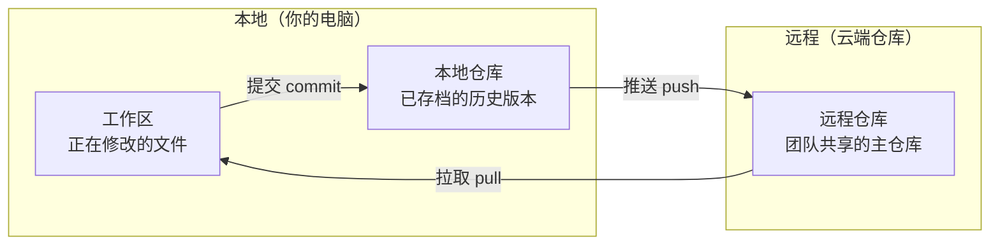
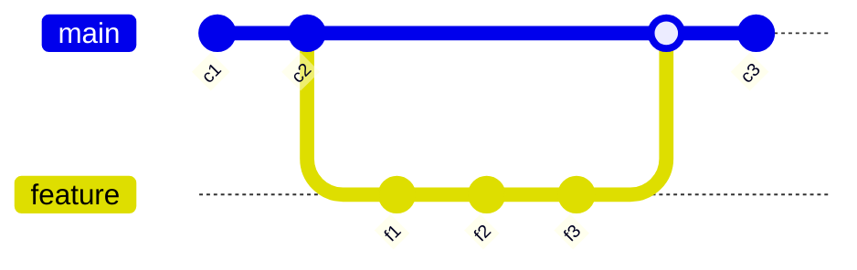
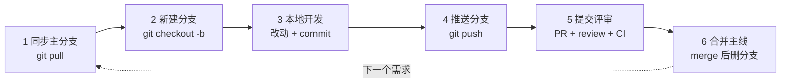
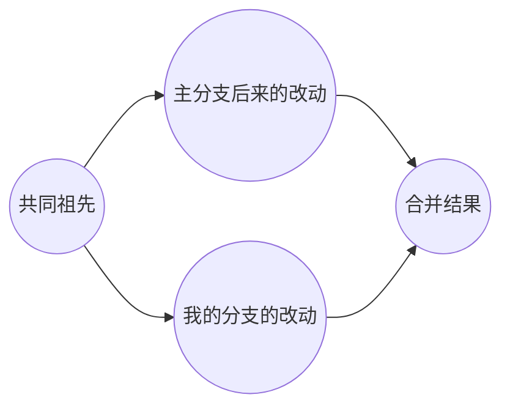
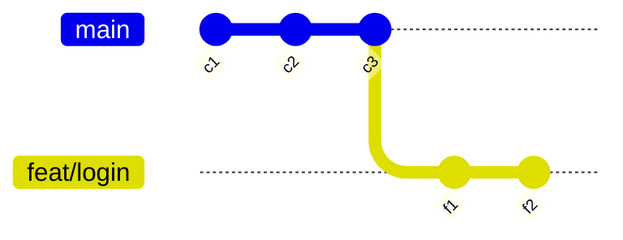
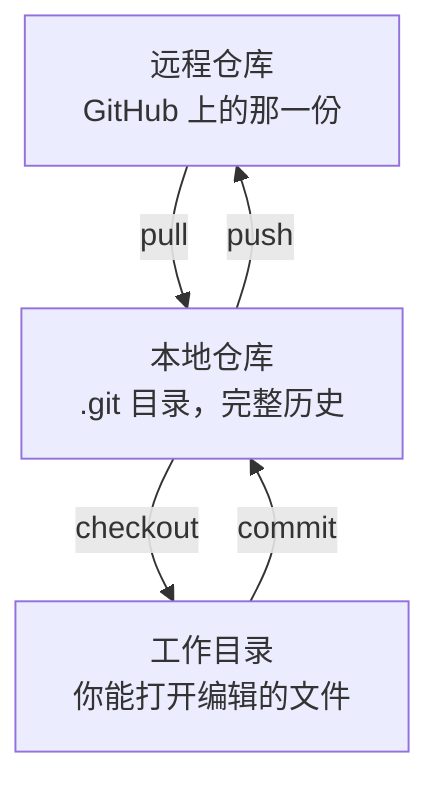

# Git 开发流程 · 问答记录

> 按对话原始顺序保留的 Q&A 对，未做知识重组。
> 表格为 Markdown 原生格式，图为 Mermaid 代码块（GitHub / Typora / Obsidian 可直接渲染）。

---

## 问题 1

**Q：开发流程中，拉取-提交推送…和合并是什么意思？**

**A：**

先给个类比：**一群人合写一本书**。云端有一份「总稿」，每个人电脑里有一份「自己的抄本」，改完再送回去合到总稿里。

四个动作就是抄本和总稿之间的来回搬运：



| 动作 | 方向 | 类比 | 什么时候做 |
|---|---|---|---|
| **拉取 pull** | 云端 → 本地 | 把总稿最新版抄回自己桌上 | 每天开工第一件事 |
| **提交 commit** | 工作区 → 本地仓库 | 在自己抄本上盖章存档，写一句「我改了第三章」 | 改完一个完整的小功能 |
| **推送 push** | 本地 → 云端 | 把盖过章的改动送回总稿 | 攒了一个或几个 commit 之后 |
| **合并 merge** | 支线 → 主线 | 把你写的支线内容缝进主线 | 功能做完，要并回主分支时 |

关键差别：commit 只动你自己的电脑，别人看不见；push 之后才是团队可见。所以 commit 可以很频繁，push 可以攒着。

merge 需要先理解「分支」——每个人从主线拉一条支线各写各的，互不干扰，写完再缝回去：



如果你和别人改了同一段内容，缝的时候机器不知道该听谁的，就会报**冲突 conflict**，需要人工挑一份留下——这是新手最容易卡住的地方，本身不是错误。

---

## 问题 2

**Q：在标准的程序开发工作场景中，这里的流程是什么样子的？帮我一步一步解释清晰**

**A：**

把上一节的四个动作串起来，标准场景就是一个**「借稿 → 单独改 → 交审 → 并稿」的循环**：每接一个需求走一圈，一圈结束分支就删掉。



| 步骤 | 在做什么 | 典型命令 | 这一步的完成标志 |
|---|---|---|---|
| 1 同步主分支 | 把云端主线最新代码抄回本地 | `git pull` | 本地 main 和远程一致 |
| 2 新建分支 | 从主线拉一条只属于这个需求的支线 | `git checkout -b feat/login` | 你在自己的分支上，改坏也不影响别人 |
| 3 本地开发 | 写代码，改一小段就存一次档 | `git add .` → `git commit -m "..."` | 若干条 commit，只在你电脑上 |
| 4 推送分支 | 把这条分支送到云端，团队可见 | `git push -u origin feat/login` | 云端出现同名分支 |
| 5 提交评审 | 开 PR，等人看代码 + 机器跑测试 | 在 GitHub / GitLab 页面操作 | Review 通过 + CI 全绿 |
| 6 合并主线 | 把分支缝进主线，然后删掉分支 | 页面点 Merge | 主线包含你的功能，分支消失 |

几个容易被忽略但很关键的点：

**第 1 步不能省。** 直接在旧代码上开分支，等你做完，主线已经跑远了，第 6 步大概率冲突。开工前先 pull，是成本最低的防冲突手段。

**第 5 步是整个流程的质量闸门。** PR（GitHub 叫 Pull Request，GitLab 叫 Merge Request）本质是一个「申请把我的支线并进主线」的工单，上面挂着两道检查：人工 review（同事逐行看代码、留评论）和 CI 自动化（机器跑单测、跑构建、跑 lint）。两道都通过才允许点 Merge。你作为 PM 能在 PR 页面直接看到需求的实现状态和卡在哪一环。

**分支是短命的。** 健康的分支生命周期是几小时到两三天。拖到两周以上，主线已经变了太多，合并会变成一场灾难——这也是为什么需求要拆小。

**冲突通常发生在第 6 步之前。** 标准做法是在提 PR 前先把主线的最新改动拉进自己分支（`git pull origin main`），在自己的分支上把冲突解掉，再交审。这样主线永远是干净的。

---

## 问题 3

**Q：我现在理解一下——**

> 1. **同步主分支**：每个人手里的版本文件都不同，需要一个最新唯一的参照基准即云端仓库的版本，它是专人维护的确认版文件。每个人每次开发就需要从云端仓库获取这个最新的文件（因为每个人开发的每个功能都不同，所以每个人手里的版本都是五花八门的），这个步骤叫同步主分支。
> 2. **新建分支**：当主分支获取之后，在本地开发时，需要从下载的这个主文件开一个分支进行开发，目的是为了犯错时兜底，其次也可以用 worktree 或者 Fork。
> 3. **本地开发**：当 Git 把文件初始化，基础环境准备好，就进入了开发环节，提交就是为了同步 Git 记录存档，方便回滚。
> 4. **推送分支**：当开发完毕，就需要把本地的分支进行合并，整理好基础的文档，然后推送到云端仓库，申请合并代码。
> 5. **提交评审**：当收到合并申请，需要对代码做自动化检测，以及人工的 Review，需要完全通过。
> 6. **合并主线**：代码通过评审之后，合并进主分支。（至于怎么合并，逻辑是什么？这里没懂）

**A：**

整体理解已经到位了，六步的骨架完全对。有四处需要校正，然后重点讲 merge。

**1. 同步主分支** — 方向对，但有两个细节偏了。你从云端拉下来的不是「一份最新文件」，而是**整个仓库的完整历史**（每一次 commit、每一条分支都在你本地）。所以 Git 叫「分布式」——断网你照样能查三个月前的改动。另外主分支不是靠专人手工维护的，是靠流程（PR + review + CI）保证的，没有人有权限直接往主分支上写。

**2. 新建分支** — 「兜底」只是副产品，主要目的是**隔离**：五个人同时改同一个仓库互不干扰。另外 branch / worktree / fork 不是三个可替换的选项，是三个层级的东西：

| | 是什么 | 解决什么问题 |
|---|---|---|
| **branch 分支** | 同一个仓库里的一条独立开发线 | 多人/多需求并行，互不干扰 |
| **worktree** | 同一个仓库，在硬盘上开出第二个工作目录 | 「手上的活没干完，但要紧急切去修个 bug」 |
| **fork 派生** | 在云端把整个仓库复制一份到你名下 | 你**没有**这个仓库的写权限（开源协作的标准姿势） |

日常团队开发用 branch，fork 主要出现在开源项目。

**3. 本地开发** — Git 不负责准备开发环境（装依赖、起服务是另一套事）。commit 的价值也不止回滚：它是 review 的最小单元、是排查 bug 时二分定位的锚点、也是记录**「为什么这么改」**的地方。这就是为什么 commit message 要写清楚意图而不是「修改」两个字。

**4. 推送分支** — 这里有个概念串了：push 之前**不需要合并本地分支**。你本地就是一条分支上的一串 commit，push 就是把这串 commit 原样传到云端。你说的「整理」如果指的是把零碎 commit 压成整齐的几条，那个动作叫 rebase / squash，跟 merge 是两回事。

### merge 的逻辑

Git 合并不是「拿新的覆盖旧的」，而是**三方比较（three-way merge）**：



Git 先找到两条分支**最后一次相同的那个节点**（共同祖先），然后拿三份内容逐块对比——祖先、主分支现在的样子、我的分支现在的样子。判断规则只有三条：

| 情况 | Git 的处理 |
|---|---|
| 只有我改了这块 | 采用我的 |
| 只有主分支改了这块 | 采用主分支的 |
| 两边都改了同一块，且改法不同 | **报冲突**，交给人决定 |

关键在于「共同祖先」这个参照点。没有它，Git 只能看到两份不同的文件，无法判断某处差异是「你新加的」还是「对方删掉的」——有了祖先，就能分辨每一处改动**属于谁**。这也是为什么删掉一行和没写过这一行，在合并时结果完全不同。

还有一种最简单的情况叫 **fast-forward**：如果你开分支之后主线一动没动，那根本不需要三方比较，Git 直接把主线的指针往前挪到你分支的末端就完事了。

至于「怎么合并」，GitHub / GitLab 上那个按钮通常有三个选项，区别只在于**合并后主线的历史长什么样**：

```
Merge commit        ○──○─────╮────●──○
                        ╰──○──○──╯

Squash and merge    ○──○────●────○

Rebase and merge    ○──○──●──●──○
```

| 策略 | 主线上留下什么 | 什么时候用 |
|---|---|---|
| **Merge commit** | 你的每一条 commit 都在，外加一个合并节点，分叉痕迹保留 | 想完整保留开发过程，或合并的是长期分支 |
| **Squash and merge** | 你的 N 条 commit 被压成 1 条 | 最常见。一个 PR = 主线上一条记录，历史干净好查 |
| **Rebase and merge** | 你的 commit 逐条接到主线末尾，没有分叉 | 想要一条完全笔直的历史 |

这三个选择不影响最终代码内容，只影响历史的可读性——所以它是团队规范问题，不是技术问题。大部分产品团队默认用 Squash，因为回头查「这个功能是哪次改的」时，一条记录比二十条零碎 commit 好用得多。

---

## 问题 4

**Q：**

> 1. 新建分支是在哪里执行的，在云端 Git 仓库还是在本地？这里涉不涉及同步的问题？
> 2. branch / worktree / fork 这三个概念我还不是很懂？
> 3. 本地开发不太懂，需要全量解释。
> 4. 推送分支不懂，需要全量解释。
> 5. merge 模块不懂，需要全量解释。
> 6. 结合步骤的流程做全量的梳理与解释。

**A：**

### 1. 新建分支在哪里执行？涉不涉及同步？

**纯本地执行，完全不需要联网，也不涉及任何同步。**

原因在于：第 1 步 pull 的时候，你已经把整个仓库的**完整历史**拉到本地了。新建分支不需要向云端要任何东西。

更关键的一层理解——**分支不是代码副本，而是一个指针**。它本质上只是一个记录着「我指向哪个 commit」的小文件，大小 41 个字节。



`git checkout -b feat/login` 做的事，只是「在当前这个 commit 上贴一个新标签，然后让我站到这个标签上」。你每 commit 一次，这个指针就往前挪一格。

**云端什么时候知道有这条分支？** 直到你执行第 4 步 push。在此之前，这条分支只有你自己看得见，团队里没有任何人知道它存在。这也是为什么第 2、3 步可以在飞机上断网干活。

（云端也能建分支，GitHub 页面上有按钮，但那是给特殊场景用的，日常开发不这么走。）

### 2. branch / worktree / fork

要讲清楚这三个，得先把 Git 的**三个层次**分开——你之前的困惑基本都来自这三层被当成了一层：



- **fork** 作用在最上层（仓库层）：整份复制到你名下
- **branch** 作用在中间层（历史层）：在历史上贴一个指针
- **worktree** 作用在最下层（工作目录层）：多开一份目录

| | 作用层次 | 在哪执行 | 数量关系 | 解决什么问题 |
|---|---|---|---|---|
| **branch** | 历史层 | 本地（可推到云端） | 一个仓库里可以有无数条 | 多人 / 多需求并行，互不干扰 |
| **worktree** | 工作目录层 | 本地 | 一个本地仓库对应多个目录 | 手上活没干完，要临时切去另一条分支 |
| **fork** | 仓库层 | 云端 | 从别人的仓库复制出一个新仓库 | 你**没有**原仓库的写权限 |

三句话记住区别：

**branch 是同一个仓库里的岔路。** 你切换分支时，Git 把工作目录里的文件整体替换成那条分支的样子。所以同一时刻，你的工作目录只能显示一条分支。

**worktree 是打破上面这个限制。** 正常情况你要切分支，得先把手上没做完的活 commit 或者暂存起来，很烦。worktree 让你在硬盘上再开一个目录，两条分支同时摊开，两个编辑器窗口并排看。它们共享同一份历史，只是多了一个「取景框」。属于进阶技巧。

**fork 是换了一个仓库。** 你想给一个开源项目提改进，但你不是维护者，没法往人家仓库里 push。于是 fork 一份到自己账号下——现在这是你的仓库，随便写。改完之后从你的 fork 向原仓库发起 PR，由原维护者决定收不收。

> **在公司团队里，99% 的时间只用 branch。** fork 是开源协作的模式，worktree 是效率技巧。

### 3. 本地开发：全量解释

先纠正一个说法：Git **不负责**准备开发环境。装依赖（`npm install`）、起本地服务、连数据库，这些跟 Git 没关系。Git 只管一件事——**记录文件的变化历史**。

本地开发的核心，是理解 Git 把你的改动分成了**三个区**：


**为什么要有暂存区？** 这是新手最不理解的一环。

类比：暂存区是**打包前的纸箱**。你一上午改了 5 个文件，其中 3 个属于登录功能，另外 2 个是顺手改的文案错别字。暂存区让你先把那 3 个放进箱子封成一个 commit，再把另外 2 个封成第二个 commit。没有暂存区，你就只能把 5 个改动一锅端成一条记录，日后回滚时想单独撤掉错别字那部分都做不到。

日常命令就这几条：

| 命令 | 作用 |
|---|---|
| `git status` | 现在哪些文件改了、哪些已经进箱子了 |
| `git diff` | 看具体改了哪几行（还没进箱子的部分） |
| `git add <文件>` / `git add .` | 挑进箱子 / 全部挑进箱子 |
| `git commit -m "说明"` | 封箱，写上标签 |
| `git log` | 翻历史记录 |

**一次 commit 包含三样东西**：改了什么（整个项目在那一刻的快照）、谁在什么时候改的、以及**为什么改**（就是那句 message）。每个 commit 有一个唯一 ID（一串哈希值，比如 `a3f9c2e`），这个 ID 是后面所有回滚、对比、定位操作的抓手。

**commit 粒度的判断标准**：一个 commit = 一件逻辑上完整的事，能用一句话说清楚。「修复登录接口超时」是好的；「修改」「更新」「fix bug」是坏的——三个月后你自己都不知道那次改了啥。实际节奏是一天 commit 五到十次，改一小块就封一次箱。

### 4. 推送分支：全量解释

push 做的事只有一句话：**把你本地这条分支上、云端还没有的那些 commit 传上去，并在云端创建（或更新）一条同名分支。**

它**不会**触发任何合并。push 完了，你的分支和主线在云端还是两条平行的线，井水不犯河水。要合并必须另外申请，那就是第 5 步的 PR。

```bash
git push -u origin feat/login
```

拆开看：`origin` 是远程仓库的默认代号（就是你 clone 时那个地址的别名）；`feat/login` 是分支名；`-u` 的意思是「把本地这条分支和云端那条绑定起来」，绑定之后以后直接敲 `git push` 就行，不用再写后面两截。

**push 之前推荐做一件事**（不是强制，但成熟团队都这么要求）：先把主线的最新改动拉进你自己的分支。

```bash
git pull origin main
```

原因是分工问题：**冲突要在你自己的分支上解决，不能带到主线上去解决。** 你在自己的分支里解冲突，解坏了大不了重来，不影响任何人；如果拖到第 6 步在主线上解，主线就有了一段不稳定的时间。这是「主线永远可用」这条铁律的具体落地方式。

**push 被拒绝的常见情况**：云端那条分支上有你本地没有的 commit（比如同事也在这条分支上干活，或者你本地做过 rebase）。Git 会拦住你，防止覆盖别人的工作。解法是先 pull 下来整合，再 push。有个 `--force` 强推可以绕过，但那会直接抹掉云端的记录——**只能对确认没有第二个人在用的分支使用**，主线上强推是重大事故。

push 成功之后，去 GitHub / GitLab 页面，它通常会自动弹出「你刚推了一条新分支，要提 PR 吗」的提示，点进去填标题和说明，第 5 步就开始了。

### 5. merge：全量解释

merge 之所以绕，是因为它在流程里出现了**两次，方向相反**。先把这两次分开：

| | 方向 | 在哪执行 | 什么时候 | 目的 |
|---|---|---|---|---|
| **合入** | 主线 → 我的分支 | 本地 | push / 提 PR 之前 | 把别人的新改动吸收进来，顺便在自己地盘解冲突 |
| **合出** | 我的分支 → 主线 | 云端（点按钮） | PR 通过之后 | 把你的功能正式并进主线 |

绝大多数人卡住，是因为把这两个都叫「合并」却没分清方向。**你日常手动敲 merge 命令的场合，几乎全是第一种。** 第二种是在网页上点一下按钮，Git 命令你根本不用碰。

**合并的内部逻辑**，就是上一轮讲的三方比较：找到两条分支的共同祖先，拿「祖先 / 主线现状 / 我的现状」三份内容逐块对比，只有一边改的就采用那一边，两边改了同一块才叫冲突。

**冲突具体长什么样。** Git 会直接在文件里插入标记，把两个版本都摆出来：

```
<<<<<<< HEAD
const timeout = 3000;
=======
const timeout = 5000;
>>>>>>> feat/login
```

上半截是主线的版本，下半截是你的版本。解决冲突 = 你手动把这段编辑成最终想要的样子（可能选上面、可能选下面、也可能两个都不要另写一个），**把那三行标记删干净**，然后 `git add` + `git commit`。没有任何魔法，就是人工做决定。Git 从来不敢替你猜——因为它不懂业务，5000 还是 3000 只有你知道。

**merge 和 rebase 的区别**（本地整合主线改动时的两个选项）：

| | 做法 | 历史形态 | 代价 |
|---|---|---|---|
| **merge** | 造一个新的合并节点，把两边接起来 | 保留分叉痕迹 | 历史图会有很多交叉 |
| **rebase** | 把你的 commit 摘下来，重新接到主线末端 | 一条直线 | commit ID 全部变了 |

因为 rebase 会改写 commit ID，所以有一条铁律：**不要 rebase 已经 push 出去、并且别人正在用的分支。** 别人手上的 ID 和你的对不上，整个团队会乱。只在自己的、还没分享出去的分支上 rebase。

**合并完成之后的收尾**（很多人漏掉这步）：删掉云端分支（PR 页面上有个按钮），本地切回主线，再 pull 一次把刚合进去的东西拿下来。这时你的本地又回到了第 1 步的干净状态，可以接下一个需求。

### 6. 全流程梳理

把上面全部串起来，一次完整的开发循环是这样。重点看后两列——**哪些是本地动作、什么时候团队才看得见你**：

| 阶段 | 干什么 | 命令 / 操作 | 位置 | 团队可见 |
|---|---|---|---|---|
| **1 同步主分支** | 切回主线，拉最新历史 | `git checkout main` + `git pull` | 本地 ↔ 云端 | — |
| **2 新建分支** | 在当前 commit 上贴一个新指针 | `git checkout -b feat/login` | 纯本地 | ❌ 不可见 |
| **3 本地开发** | 改代码，分批封箱 | `git status` → `git add` → `git commit` | 纯本地 | ❌ 不可见 |
| **3.5 合入主线** | 吸收别人的新改动，本地解冲突 | `git pull origin main` | 本地 ↔ 云端 | ❌ 不可见 |
| **4 推送分支** | 把这串 commit 传上云端 | `git push -u origin feat/login` | 本地 → 云端 | ✅ 分支可见 |
| **5 提交评审** | 开 PR，等 CI + 同事 review | 网页操作 | 云端 | ✅ |
| **6 合并主线** | 选 Squash / Merge / Rebase，点合并 | 网页点按钮 | 云端 | ✅ 进入主线 |
| **7 收尾** | 删分支，切回主线，再拉一次 | 网页删分支 + `git checkout main` + `git pull` | 本地 ↔ 云端 | — |

三条贯穿全程的原则：

**主线只读。** 没有人直接往 main 上写代码，所有改动必须走「开分支 → PR → 评审 → 合并」这条唯一通道。这不是礼貌，是权限设置强制的（叫分支保护规则）。

**分支要短命。** 从第 2 步到第 7 步，健康的周期是几小时到两三天。拖得越久，主线跑得越远，第 3.5 步要解的冲突就越多。需求拆得细，本质上是为了让分支活得短。

**冲突在自己家里解。** 第 3.5 步存在的全部意义就是这个——把所有不确定性消化在你的分支上，交到主线的东西必须是已经跟主线对齐过、CI 跑绿了的干净代码。
